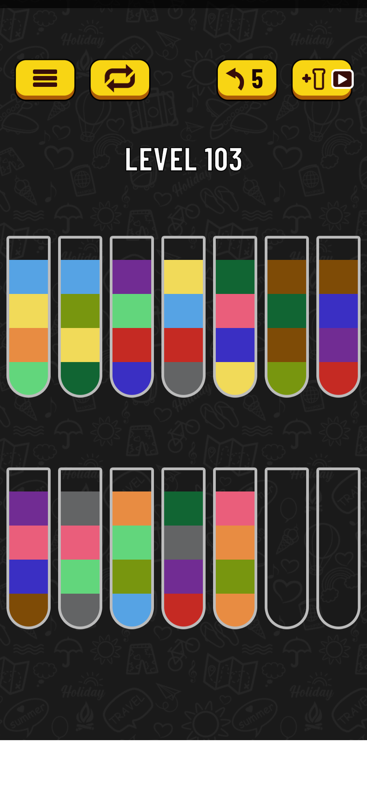
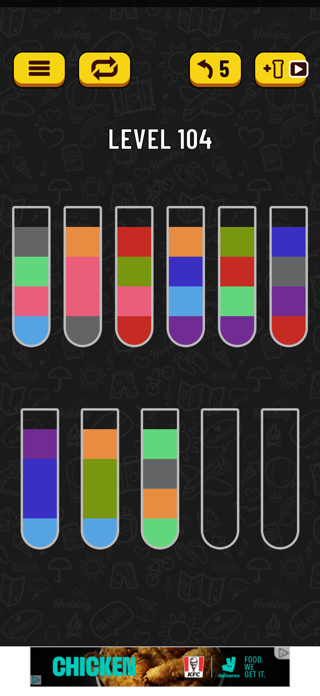

 

# Water Sorting AI Player

A fully automated AI player that plays water sorting puzzle game on mobile phones.

## The Game

https://play.google.com/store/apps/details?id=com.gma.water.sort.puzzle

Below are screenshots from the game for 2 different levels. 

## Overview

The AI player has 4 main steps:

1. Read level image from connected phone.
2. Scan the level image and represent in a data structure.
3. Solve the level given the level representation. Come up with a list of steps e.g. <Move tube X to tube Y>.
4. Given the solution steps, emulate touch events on the connected phone.

## Requirements

- `requirements.txt`
- Android Debug Bridge (change path in `/src/common/constants.py`)
