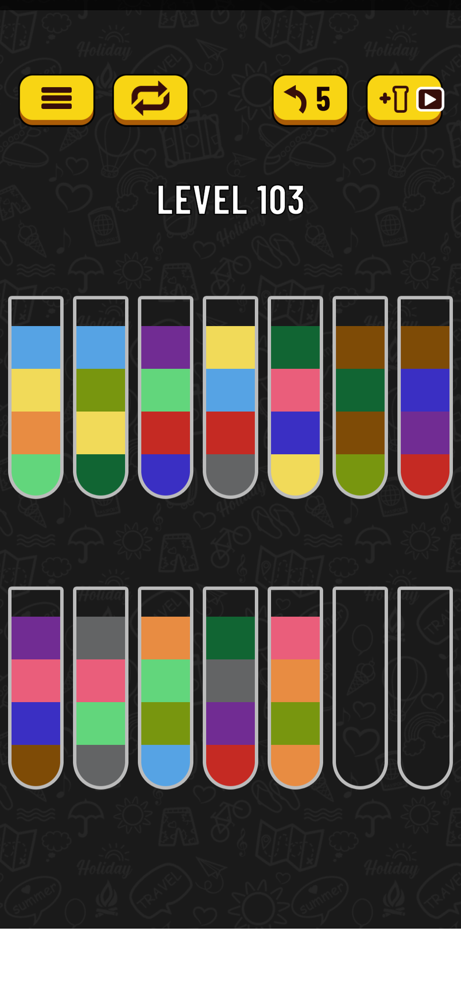
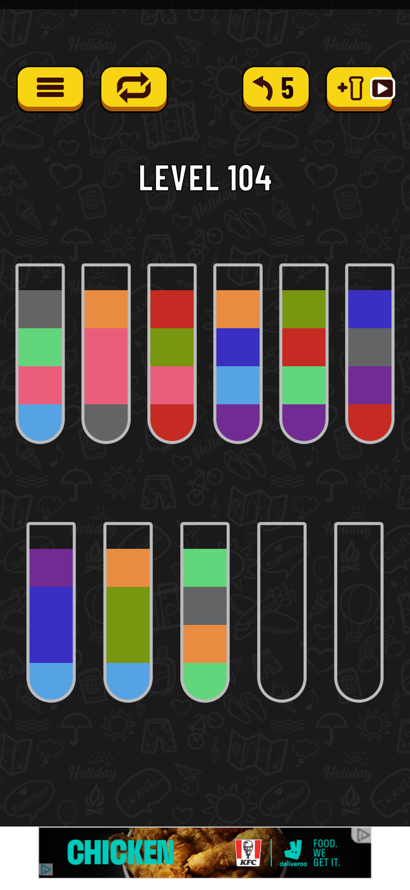

# Water Sorting AI Player
A fully automated AI player that plays water sorting puzzle game on the connected Android phone

## The Game

https://play.google.com/store/apps/details?id=com.gma.water.sort.puzzle

Below are exact screenshots from the game for 2 different levels. This is exactly what we will be working with. 

## Requirements

- `requirements.txt`
- Android Debug Bridge (change path in `/src/common/constants.py`)
